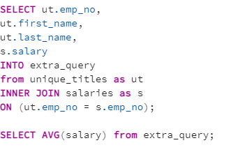

# Pewlett-Hackard-Analysis
Module 7

## Overview

The main purpose of this analysis is to help the manager of Pewlett-Hackard
determine the number of upcoming employees who will be retiring from the 
workforce. Should these people retire, there will be a large deficit in 
veteran employees. To leverage this, PH has constructed a new employee training
program with incentives for the retiring, more experienced employees. This 
analysis delivers insight on the number of employees up for retirement and
provides a list of eligible employees for the mentorship program.

## Results

- In order to find employees eligible for retirement, we first needed to retrieve all employees born within the years of 1952 to 1955. This initial search required importing data from `employees.csv` and creating a table based off that data. We then used the employee id number (emp_no) to match data from the `titles.csv` file (which was also converted into a table in postgres),
ultimately to join the two data sets together. This returned all employees who 
are of retirement age, and their titles. This was then saved as its own data
table in the `retirement_titles.csv`.

- The data was not clean though, as there were duplicate records of employees and the titles they held. The data also returned all retirement age employees, 
including those who no longer worked for PH. To clean the data more and provide
a more accurate count of retirable employees, the data needed to only include 
employees still employed by looking for the qualifier `to_date` of `9999-01-01`.
The data was then cleaned again by finding the first and most up to date record
of the employee to reduce counting them in titles they were no longer holding.
The resulting data was then exported into a new table and saved in the file
`unique_titles.csv`

- PH will need to not only be aware of who is retiring and their titles, but which roles will have the most vacancies post silver tsunami. PH can use this data to effectively plan for the vacancies by strategically promoting junior engineers who will not be retiring and providing these retiring senior engineers the opportunity to be part of the mentorship program to replace some of the junior engineers who could potentially be promoted to senior rank. In addition, this data gives insight to how age and ranking witihn a corporation correlates.

- PH has a total of 1549 qualified employees who are eligible for the mentorship program. This is drastically different than the amount of employees retiring, and leaving many job positions vacant. PH should consider expanding the mentorship program to more employees and making that part of their everyday workday as they segue into retirement age- and maybe consider turning the mentorship program into an Apprenticeship program for fresh college graduates and bootcamp graduates. This offsets the drastic difference in 'ready to retire now' employees eligible for the mentorship program vs the potential open vacancies. This may also entice long standing employees to stay with the company longer, which potentially staggers the cost of retirement packages supplied by PH to the retirees.

## Summary

In summation, the silver tsunami will cause PH to lose 72,458 employees, which means there will be 72,458 vacancies. Unless PH does adapt its mentorship eligibiility program as suggested in the above statement, in short, PH does not have enough qualified, retriement- ready employees to mentor the next generation of PH employees.

### Queries to consider

As the retirees begin their journey to retirement-land, a query that may be useful is figuring out the average salary of the retiree. This gives insight to how PH may allocate its funding in the oncoming years to plan proper education for the newer employees, potentially allocate funds for employee recruitment, and aid in efforts to keep employee turnover low as the retirees leave the company. The query for this is also located in queries.sql.

PH can also target specific departments to gauge the average salary. This information will allow PH to have a good understanding of when recruiting, what salaries to publish as expected for future potential employees.

